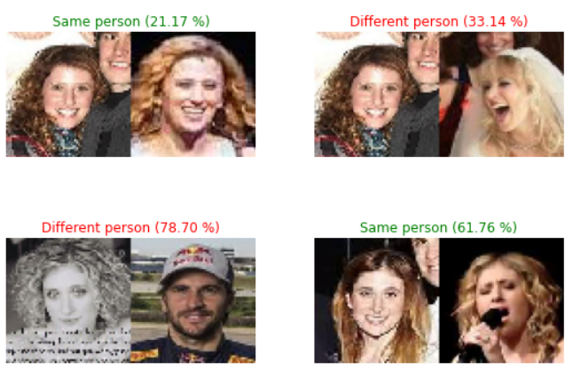

# Face Recognition | Reconhecimento de Faces

Esse notebook contém um exemplo de aplicação para reconhecimento de faces produzido para a disciplina de Visão Computacional 2 do Programa de Residência do CIn-UFPE.

O problema proposto foi: 

> Dado um par de imagens de faces, identifique se as faces pertencem a mesma pessoa.

Existe um exemplo do dataset das pastas `TinyVGGFace2-Train` e `TinyVGGFace2-Test`, que foram obtidos do dataset [VGGFace2](https://academictorrents.com/details/535113b8395832f09121bc53ac85d7bc8ef6fa5b).

  
⠀

  

  
⠀

  

